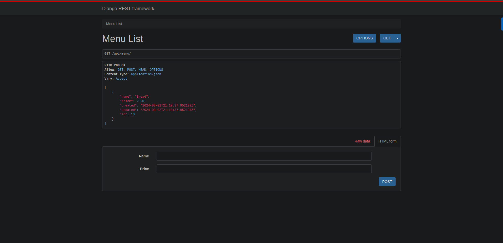

# Menu App

Backend code base for the Menu app

## Contents

- [About](#About)
- [Features](#Features)
- [Tech Stack](#Tech)
- [Installation](#Installation)
- [Production](#production)
- [Deployment](#deployment)
- [Demo](#demo)
- [Acknowledgements](#acknowledgements)

## About

This is a Menu Management Application built using Django, and Django REST Framework. It allows users to view, add, update, and delete menu items. The app utilizes Fetch API and follows REST API practices.

## Features

- View a list of menu items
- Add new menu items
- Update existing menu items
- Delete menu items

## Tech Stack

- **Django**: High-level Python web framework that encourages rapid development and clean, pragmatic design.
- **Django REST framework**: A powerful and flexible toolkit for building Web APIs.
- **SQLite**: A C-language library that implements a small, fast, self-contained, high-reliability, full-featured, SQL database engine.
- **PythonAnywhere**: Host, run, and code Python in the cloud.

## Installation

1. Clone the repository:

   ```sh
   git clone https://github.com/sravanpant/Full_Stack_App_Django_Backend/
   cd Full_Stack_App_Next_Backend/RestaurantCore
   ```

2. Install dependencies:

   ```sh
   pip install -r requirement.txt
   ```

3. Run the development server:

   ```sh
   python manage.py runserver
   ```

4. Open [http://localhost:8000](http://localhost:8000) in your browser to view the app.

## Production

To create an optimized production build, run:

```sh
python3 manage.py check --deploy
```

And make changes accordingly to the warnings.

## Deployment

The easiest way to deploy your Django app is to use the [PythonAnywhere](https://www.pythonanywhere.com/).

Check out the [Django tutorial in MDN ](https://developer.mozilla.org/en-US/docs/Learn/Server-side/Django/Deployment#example_hosting_on_pythonanywhere) documentation for more details.

## Demo



## Acknowledgements

- [Menu Project Blog](https://dev.to/koladev/building-a-fullstack-application-with-django-django-rest-nextjs-3e26)
- [Django](https://docs.djangoproject.com/en/5.0/)
- [Django REST Framework](https://www.django-rest-framework.org/)
- [Django MDN tutorial](https://developer.mozilla.org/en-US/docs/Learn/Server-side/Django)
- [PythonAnywhere](https://www.pythonanywhere.com/)
